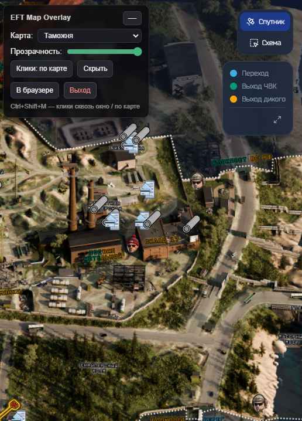
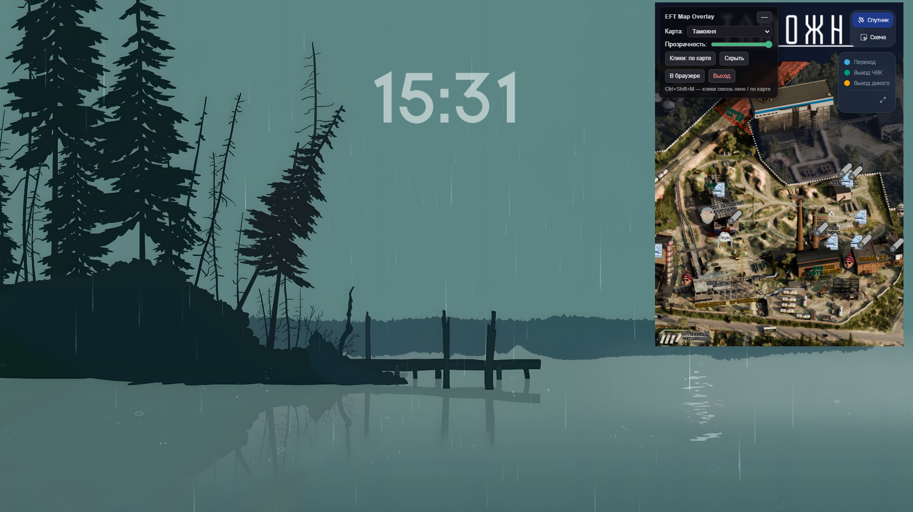
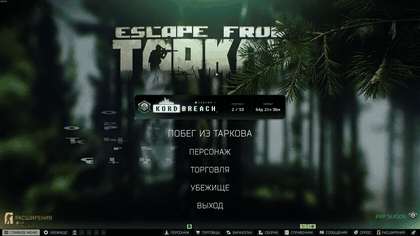
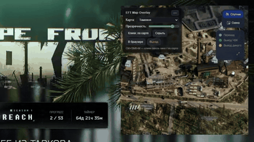
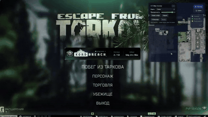
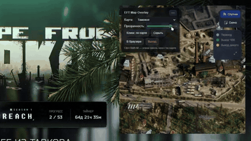
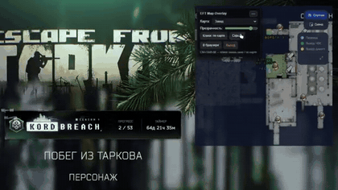

# EFT Map Overlay

Прозрачная интерактивная карта **eft.su** поверх окна **Escape from Tarkov**.

Оверлей — это обычное окно **поверх всех окон**. Оно **не читает память игры** и **ничего не инжектит** в её процесс — легальный внешний оверлей, безопасный для BattlEye (как открытая вторая вкладка браузера).


## 📸 Скриншоты

<table>
  <tr>
    <td align="center"></td>
    <td align="center"></td>
  </tr>
</table>

## ⬇️ Загрузка

Готовые сборки лежат в разделе **[Releases](https://github.com/Awaynos/eft-map-overlay/releases)**:

1. Скачай `EFT-Map-Overlay-<версия>-portable.exe`
2. Запусти двойным кликом — **ничего устанавливать не нужно**
3. Если Windows SmartScreen предупредит — **«Подробнее» → «Выполнить в любом случае»** (это норма для любой самособранной программы)

## 🎮 Как использовать

| Действие | Горячая клавиша |
|---|---|
| Клики **в игру** ⇄ **по карте** | `Ctrl+Shift+M` |
| Свернуть / развернуть меню | `Ctrl+Shift+C` или наведение мыши на «—» / 🗺 |
| Показать / скрыть оверлей | `Ctrl+Shift+H` |
| Прозрачность ± | `Ctrl+Shift+PageUp / PageDown` |
| Быстрая смена карты (1–10) | `Ctrl+Shift+1 … 0` |
| Выход | `Ctrl+Shift+Q` |

Особенности:
- Клики **сквозные**: карта видна, но прицел и стрельба не блокируются. Наведи курсор на панель — она станет кликабельной.
- **При смене карты** меню автоматически разворачивается.
- Настройки (карта, прозрачность, положение окна) запоминаются.

## 🗺 Карты

Завод, Таможня, Лес, Маяк, Берег, Резерв, Развязка, Улицы Таркова, Лаборатория, Эпицентр, Лабиринт, Ледокол.

## ⚙️ Сборка из исходников

Требуется [Node.js](https://nodejs.org) (v18+):

```bash
npm install          # первый раз скачает Electron (~100 МБ)
npm start            # запуск
npm run dist         # собрать portable-версию в release/
```

## 💡 Важно для игры

В настройках EFT включи режим окна **«Окно без рамок» (Borderless / Fullscreen windowed)** — в эксклюзивном полноэкранном режиме Windows не показывает оверлей поверх игры.

## 🔒 Бан?

Приложение не читает память игры, не инжектит код и не показывает твою позицию автоматически — по позиции BattlEye не-чит оверлеи разрешены. Бан грозит только за радары/ESP, которых здесь нет и не будет.

## ❤️ Донат

Разработка и поддержка оверлея занимает время — буду благодарен за поддержку 🫡

**Внимание:** отправляй перевод **только в указанной сети** — перевод в другой сети может быть потерян безвозвратно.

| Монета | Сеть | Адрес |
|---|---|---|
| **Bitcoin (BTC)** | Bitcoin (SegWit) | `bc1qfaylkgnwct052snamqmnxl3uk26xpt5jg344fs` |
| **Ethereum (ETH)** | ERC-20 | `0x44628629c1C6f8E8591d4f93735Ff6CD70DC8AfC` |
| **Tether (USDT)** | BEP-20 (BSC) | `0x44628629c1C6f8E8591d4f93735Ff6CD70DC8AfC` |
| **Solana (SOL / SPL)** | Solana | `3sTNRxJqATsJsKWyM5dxi4HHMLEKbp8f8dGU4wJ1xmE9` |

## 🎬 Демонстрация

Оверлей в работе:








## 📄 Лицензия

Проект распространяется под [лицензией MIT](LICENSE) — [перевод на русский](LICENSE-RU).